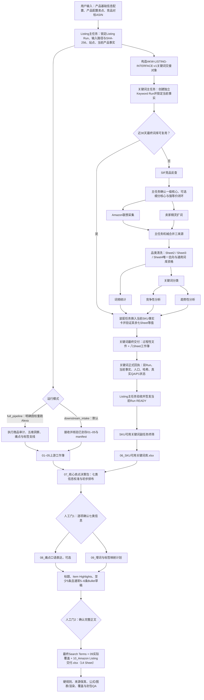
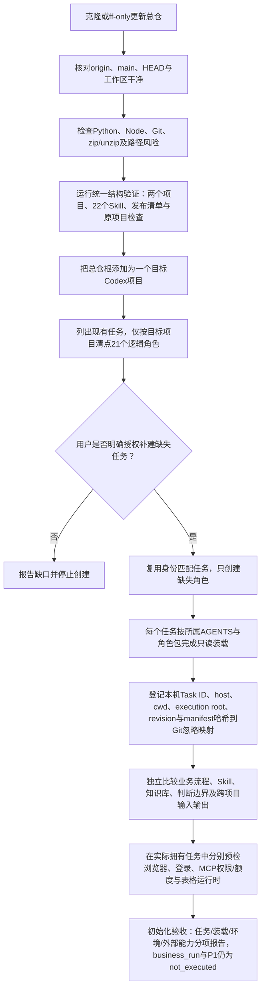

# Amazon Keyword Library + Listing Auto Writing

同一 Git 仓库、一个 Codex 项目中的两个独立业务模块。Listing 主任务是整条产品输入到 Listing 交付的统一入口；关键词主任务管理关键词子流程及其专责模块。完整 Skill、知识、判断边界、双 Run、正式回执和两道人机确认门均保留，不合并业务执行权。

当前GitHub仓库：[amazon-keyword-library-listing-auto-writing](https://github.com/Ryanwsq/amazon-keyword-library-listing-auto-writing)。这是原仓库改名，不是新仓库；两个内部项目ID和相对目录保持不变，历史交接中的旧名称保留其当时含义。见[仓库名称与版本记录](docs/repository-identity.md)。

## 仓库结构与权威入口

| 项目 | 工作入口 | 负责的结果 |
|---|---|---|
| Amazon关键词词库 | [项目说明](projects/amazon-keyword-library/README.md) · [任务入口](projects/amazon-keyword-library/AGENTS.md) · [端到端流程](projects/amazon-keyword-library/docs/end-to-end-workflow.md) | 三来源关键词采集、清洗、分类与分析、八Sheet工作簿；以及符合条件的近30天最终词库复用 |
| Listing撰写信息决策 | [任务入口](projects/amazon-listing-pipeline/AGENTS.md) · [流程总图](projects/amazon-listing-pipeline/.agents/skills/orchestrate-amazon-listing-pipeline/references/pipeline-map.md) · [输出合同](projects/amazon-listing-pipeline/.agents/skills/orchestrate-amazon-listing-pipeline/references/output-contract.md) | SKU终筛、标签/痛点/卖点决策、两次人工确认、Listing写作与14Sheet最终装配 |

根目录只负责仓库导航、项目登记和统一机械检查。业务任务必须从所属项目目录或其明确的角色包启动；不得把两个项目的业务规则合并，也不得从全局同名Skill或另一个项目的副本回退补文件。Git revision属于总仓，业务相对路径则始终以各自项目根解析。

## 从用户输入到最终输出

日常完整业务从`Listing撰写信息决策｜项目主线程`进入。明确只做独立关键词项目时，才直接进入`Amazon关键词词库｜主任务｜main`。下面是跨项目完整流程的导航图；具体字段、阈值、来源备用条件和停止门仍以图中链接到的项目拥有文件为准。



### 各阶段实际做什么

1. **输入与版本锁定**：Listing主任务把三组输入、目标Amazon类目、是否存在多个稳定产品类型细分、站点、品牌、当前SKU事实和原始直接竞品锁成当前Listing Run。`full_pipeline`读取单一主输入工作簿；默认`downstream_intake`接收已封存的01–05及manifest。缺失事实保持未知，不从标题、竞品或历史SKU猜测。
2. **Alexa与市场证据支线**：商品审计生成02、03；五维洞察生成01并供标签阶段生成05；痛点频率生成04。不同支线保留各自样本、来源和失败状态，技术失败不能写成“没有事实”或0。
3. **跨项目关键词支线**：Listing主任务按[交接合同](projects/amazon-listing-pipeline/.agents/skills/orchestrate-amazon-listing-pipeline/references/keyword-handoff-contract.md)发送来源定位与哈希。关键词项目使用独立Keyword Run；先判断合规复用，否则执行SIF、Amazon联想、卖家精灵、清洗、分类、词频、竞争、趋势和装配。关键词最终交付固定为过程目录及八Sheet工作簿。
4. **正式回执与SKU终筛**：关键词总工作簿可以先由SKU任务预接收，但预接收不是运行授权。Listing主任务核对双Run、revision、事实卡、工作簿和process manifest哈希、人口及真实上游状态后，才签发当前Run READY。SKU任务随后生成06；Listing不能绕过SKU终筛直接使用关键词总表。
5. **信息校准与人工门1**：01–06汇合成07，用户必须确认标签排序、全部卖点及优劣势、痛点与样本限制、P0选择、主图1–9、A+1–7和ST未决规则。只确认一个Top 1卖点不算完成。
6. **埋词、草稿与人工门2**：完整07确认后生成必要的08、09计划和实际Title、Item Highlights、全部Bullet草稿。用户确认完整正文后，才允许生成最终Search Terms、回填09实际覆盖并装配10。
7. **最终输出**：新建schema 2.0 Run的10固定为14个Sheet，并保留四张关键词来源表及三张优先级展示表。最终QA检查事实、字符/字节、重复、埋词覆盖、公式、样式、图表、渲染和来源保真；不得声称已经通过Amazon审核。

关键词的`production`与`test-validation`质量路由不同：普通production由装配任务执行适用门，独立质量验证Gate记`not_applicable`；只有明确的test-validation才调度独立质量任务。结构、测试或人工满意都不能自动提升为P1。

## 新电脑拉取后的首次初始化

### 先理解四个不同状态

| 状态 | 表示什么 | 不表示什么 |
|---|---|---|
| 仓库已克隆 | Git文件存在于新电脑 | Codex项目、任务、Cookie、MCP、历史Run已迁移 |
| 任务已创建 | 目标Codex项目里已有对应任务对象 | 角色包已经完整读取或哈希一致 |
| `LOADED_READONLY` | 任务已按当前revision只读装载规则、Skill和知识并回执 | 已登录外部网站、业务可开跑或P1 |
| 业务READY | 当前Run的输入、revision、任务身份、权限、来源和输出目录均已核验 | 对未来Run的永久授权 |

初始化本身不访问业务网站、不读取密钥、不采集产品、不生成工作簿、不启动历史Run，也不签发业务READY。



### 步骤1：克隆并确认拿到远端`main`

首次安装只克隆这一个仓库。示例使用短目录名`akw`；GitHub名称不要求与本地目录同名。

```sh
git clone https://github.com/Ryanwsq/amazon-keyword-library-listing-auto-writing.git akw
cd akw
git remote -v
git branch --show-current
git status --short --branch
git rev-parse HEAD
git ls-remote origin refs/heads/main
```

验收条件：远端URL正确、当前分支为`main`、工作区没有修改，`git rev-parse HEAD`与`git ls-remote`返回的`refs/heads/main`提交一致。Windows建议使用短路径，例如`C:\work\akw`，避免角色包路径叠加深层目录；`.gitattributes`禁止自动换行转换，不得通过重算哈希掩盖CRLF漂移。

如果新电脑已经有旧克隆，先检查工作区；只有确认没有未提交或未保全修改时才快进更新：

```sh
git status --short --branch
git pull --ff-only
git status --short --branch
```

工作区不干净、分支分叉或存在运行中任务时停止，先保全并协调；不要使用`reset --hard`、强推或覆盖旧Run。Git更新后任务不会自动重新装载，仍须执行后面的revision和角色包复核。

### 步骤2：准备并验证本机运行环境

需要Python 3.11或更新版本、Node.js 20或更新版本及Git。关键词装配隐私检查还依赖支持`-Z1`和`-p`的`unzip`；装配夹具额外需要支持`-q -r`的`zip`。工作簿生成、重新加载、公式及图表渲染还需要当前Codex执行环境提供Spreadsheets Skill及其Artifact Tool；只有openpyxl不能证明完整表格能力。

macOS / Linux，在总仓根执行：

```sh
python3 --version
node --version
git --version
python3 -B scripts/check_environment.py
python3 -B scripts/validate_projects.py
```

Windows PowerShell，在总仓根执行：

```powershell
py -3 --version
node --version
git --version
py -3 -B scripts/check_environment.py
py -3 -B scripts/validate_projects.py
```

`check_environment.py`应报告`local_prerequisites_ok=true`；`validate_projects.py`应报告`valid=true`、`projects=2`、`authoritative_skills=22`。如果系统终端与Codex使用不同Python或Node，必须在实际运行任务的环境中重新检查；不要照抄另一台电脑的绝对运行时路径。两项检查均不读取密钥、不调用付费接口，也不证明网页登录、MCP额度、真实业务或P1。

### 步骤3：在Codex中建立目标项目

把**总仓根目录**添加为一个新的Codex项目；不要另建Listing代码仓库，也不要把两个子目录或`task-packages/**/dependencies/skills`分别添加成额外Skill发现根。总仓中保留两个独立业务项目目录，Codex侧则在同一目标项目内建立完整角色任务。

新电脑上的目标项目必须独立清点。旧电脑、旧Codex项目或同名历史任务不能充当新目标任务；Git不会迁移任务归属、聊天、Task ID、worktree、浏览器Cookie、MCP配置、原始输入或历史工作簿。

### 步骤4：清点应存在的21个任务

Listing当前注册表为10个任务：

| 类型 | 固定任务标题 | 主要职责 |
|---|---|---|
| 主任务 | `Listing撰写信息决策｜项目主线程` | 整体入口、双Run交接、两个人工门、最终验收 |
| 业务 | `副线程｜SKU可用关键词库` | 接收完整关键词总表后执行当前SKU终筛，输出06 |
| 业务 | `副线程｜Alexa商品信息审计` | 本品与竞品固定字段审计，输出02、03 |
| 业务 | `副线程｜Alexa五维洞察` | 用途、场景、人群、特点和痛点洞察，输出01 |
| 业务 | `副线程｜Amazon标签优先级` | 标签归一、Coverage与优先级，输出05 |
| 业务 | `副线程｜Alexa痛点频率` | 跨ASIN痛点归一和频率，输出04 |
| 业务 | `副线程｜Alexa痛点口语表达` | 仅对已确认使用的痛点生成可选08 |
| 业务 | `副线程｜Listing硬规则与最终QA` | Listing硬规则、正文与最终QA支线 |
| 接收 | `副线程｜卖点配置文件接收整理` | 接收并整理卖点/配置文件，不越权裁决 |
| 接收 | `副线程｜标签与QA文件接收整理` | 接收标签、痛点及QA文件，不越权重跑 |

关键词当前架构为11个任务：

| 类型 | 固定任务标题 | 主要职责 |
|---|---|---|
| 主任务 | `Amazon关键词词库｜主任务｜main` | 输入锁、核心层级、调度、三来源机械合并、总门与交付 |
| 副任务 | `Amazon关键词词库｜SIF竞品反查｜main` | SIF竞品关键词和Top3证据 |
| 副任务 | `Amazon关键词词库｜Amazon联想采集｜main` | Amazon US未登录联想采集 |
| 副任务 | `Amazon关键词词库｜卖家精灵扩词｜main` | 卖家精灵完整官方导出与机械去重 |
| 副任务 | `Amazon关键词词库｜关键词清洗｜main` | 三去向及通用词库资格判断 |
| 副任务 | `Amazon关键词词库｜词频统计｜main` | 单词及相邻双词频率 |
| 副任务 | `Amazon关键词词库｜关键词分类｜main` | 流量层、语义标签、LT与否词类别 |
| 副任务 | `Amazon关键词词库｜竞争性分析｜main` | SIF Top3竞争结构 |
| 副任务 | `Amazon关键词词库｜趋势性分析｜main` | 单提供商月度与季度趋势 |
| 副任务 | `Amazon关键词词库｜最终工作簿装配｜main` | 过程目录、八Sheet工作簿及适用Gate |
| 副任务 | `Amazon关键词词库｜独立质量验证｜main` | 仅test-validation的compact/full只读QA |

关键词项目有12个权威Skill，但长期任务只有11个：`amazon-keyword-library-publication`是维护能力，与`amazon-keyword-library-operations`共同归关键词主任务，不另建第12个业务任务。

### 步骤5：获得授权后创建缺失任务

先列出目标Codex项目现有任务，逐个核对项目归属、固定标题、实际cwd和状态。匹配的任务复用；标题相同但属于旧项目、旧目录或错误revision的任务不能计入。只有用户明确授权时才创建缺少角色；文档本身、克隆操作或“检查一下”都不是创建授权。

可在新电脑的目标Codex项目主任务中发送：

> 请对当前总仓执行严格只读初始化。我明确授权：先列出并核对当前目标Codex项目已有任务，复用身份和项目归属均正确的任务，并创建缺少的Listing 10个角色任务与关键词11个角色任务；不得用旧项目、旧任务或同名索引凑数，不删除或迁移历史任务。所有新任务只进行规则、Skill、知识库、角色包和接口合同装载，不连接业务网站、不读取密钥、不采集数据、不运行历史输入、不生成业务工作簿、不签发业务READY。完成后按任务创建、实际装载、环境能力、外部登录/MCP缺口和待验收项分别报告。

### 步骤6：让每个任务完成真实的只读装载

任务创建后还必须分别装载，不能复制另一台电脑的“已加载”结论：

1. 每个任务先读取根`AGENTS.md`，确认自己属于哪个业务项目及明确执行根。
2. 关键词主任务和10个副任务完整读取`projects/amazon-keyword-library/AGENTS.md`规定的公共资料，再按`docs/thread-architecture.md`、`docs/thread-roles.md`读取自己的Skill、直接合同、知识和证据索引。
3. Listing主任务和9个角色读取`projects/amazon-listing-pipeline/AGENTS.md`及`task-packages/registry.json`，按自己唯一的role、version、package path和manifest SHA-256完整读取包内`AGENTS.md`、`Agent.md`、`LOAD_ORDER.md`以及其中规定的全部依赖正文。`dependencies/skills`是参考依赖，不能因此获得别的角色执行权。
4. 禁止从全局同名Skill、旧项目目录或另一个角色包回退；缺文件、哈希漂移、错误入口或越界路径必须阻断。
5. 每个任务回执实际Task ID、host、app cwd、`execution_project_root`、Git根、revision、角色包路径/version/manifest哈希和读取清单。真实ID、绝对路径、授权及浏览器状态只写进Git忽略的本机映射，不进入README、业务工作簿或提交。
6. 成功状态应明确为`LOADED_READONLY`，并保留`business_run=not_executed`、`P1=not_executed`；只读装载不是当前Run READY。

### 步骤7：做初始化验收，而不只数任务

验收拥有方应独立核对：

- 目标项目中恰好存在Listing 10个和关键词11个逻辑角色，无漏项、错项目、重复角色或错误cwd；
- Listing 10个角色的注册表版本、路径与manifest哈希一致，关键词11个任务分别指向正确的拥有Skill；
- 两项目原有业务流程、Skills、知识库、判断边界、人工门和输入输出均已实际读取并比较，不以文件夹存在代替；
- 双方交接协议均为`AKW-LISTING-INTERFACE-v1`，Listing Run、Keyword Run、当前事实和历史source可以分开锁定；
- `品类产品通用词库`、独立`二类词`Sheet、`F2 二级词`以及`SKU可用关键词库`保持四个不同对象；
- 真实本机映射已被Git忽略，仓库仍干净，旧电脑与旧项目保持不动；
- 表格创建/重载/公式/渲染、浏览器可操作性、网站登录、MCP工具发现、鉴权、权限和额度分别报告，未知不能写成通过或0。

只有任务创建、实际装载、流程/知识/接口比较和本机机械检查全部闭合，才能称为“初始化完成”。这仍不等于业务READY；开始新业务Run前，Listing主任务还要重新锁定当前Git revision、三组输入、双方Run、当前事实、输出目录和实际外部能力。

完整的跨电脑边界、更新步骤和初始化请求模板见[跨电脑首启与本地统一入口](docs/cross-device-setup.md)。

## 哪些网站账号需要登录

| 网站 / 能力 | 哪个任务使用 | 账号和登录要求 |
|---|---|---|
| [SIF官网](https://www.sif.com/) | 关键词：SIF竞品反查 | 有竞品流量词查询及所需字段访问权限的SIF账号；在SIF副任务实际使用的浏览器会话登录。优先网页，未登录先回传主任务`awaiting_login`；只有用户明确无法在当前设备/会话登录，才允许同提供商MCP备用。 |
| [卖家精灵官网](https://www.sellersprite.com/) | 关键词：关键词挖掘 | 有关键词挖掘及完整官方导出权限的卖家精灵账号；在卖家精灵副任务实际使用的浏览器会话登录。每个获准种子只成功导出一次。未登录先回传主任务，不直接切MCP；已登录但完整官方导出链路仍不可用时才允许同提供商MCP备用。 |
| [Amazon US](https://www.amazon.com/)搜索联想 | 关键词：Amazon联想 | **不登录**，固定US、All、邮编10001；首选内置浏览器，无法稳定操作时按原合同使用普通Chrome备用。不得为了Alexa登录而污染这个未登录采集环境。 |
| Alexa for Shopping | Listing：商品信息审计、五维洞察、痛点等获准上游任务 | 具有可用Alexa for Shopping访问权限的Amazon买家账号或已授权连接；在对应任务实际使用的会话登录并确认能访问该能力。普通Amazon页面可打开不等于Alexa可用；Seller Central卖家账号也不能替代此能力。不可用时按所属Skill停止，不能换普通搜索、商品页或模型猜测。 |
| Sorftime账户中心 | 关键词：趋势备用来源配置 | 用于开通MCP、取得密钥、查询用量；不要求采集期间持续登录网页，不授权用其其他数据替代SIF或Alexa。 |
| 飞书 | 仅明确授权的云文档同步 | 能访问并编辑目标文档的飞书账号。不是关键词/Listing本地工作簿生产的必需账号，未要求同步时不因此阻断业务。 |

登录发生在**真正执行该模块的任务和浏览器会话**中，不能只在主任务或别的浏览器登录后就声称副任务就绪。账号、密码、验证码由用户直接在官网输入；不写进输入表、聊天、README、Skill、manifest或Git。每次实际采集前仍按所属Skill复核登录，Git拉取不会迁移Cookie。

## 需要配置哪些MCP

| MCP | 本项目需要的只读数据能力 | 使用边界 |
|---|---|---|
| SellerSprite MCP | 精确关键词的历史月搜索量；关键词挖掘作为获准备用入口 | 趋势首选提供商。准备有效密钥、所需接口权限和足够用量；网页会员与MCP可用次数分别检查。挖掘仍优先官网完整导出，不因MCP已配置而跳过网页。 |
| SIF MCP | 获准竞品ASIN流量词及合同所需SIF证据字段 | 仅按SIF网页登录备用条件启用。竞争判断仍只使用SIF的Top3点击份额和Top3转化份额；不能借机换成其他提供商指标。 |
| Sorftime MCP | 精确完整关键词的历史月搜索量 | SellerSprite趋势不可用时的备用。一个Run的全部趋势词和月份只使用一个提供商；不跨源补月，中途切换须按原合同重跑全部趋势人口。 |

MCP服务名可以因客户端配置不同而变化；启动时按提供商、工具参数和实际字段核对，不能只认同名插件。当前公开仓库不内置这些服务，不附送会员、额度或密钥；可看到工具列表不等于鉴权、权限、周期覆盖及额度都正常。Alexa和Amazon联想不因装好这三个MCP而获得替代来源。

### MCP配置步骤

1. 用本人或获授权组织账号进入各提供商官方后台，分别开通需要的MCP权限并取得连接配置。不要使用来历不明的第三方代理或把Cookie改装成备用接口。
2. 在当前电脑的Codex配置中登记服务地址、传输方式和官方要求的认证方式。配置是本机状态；仓库忽略`.codex/`、`.env*`等敏感文件，不提交真实配置。Codex支持`[mcp_servers.<name>]`、环境变量认证头及`codex mcp list`检查登记，详见[OpenAI MCP配置文档](https://developers.openai.com/codex/mcp/)。
3. 刷新连接后，在实际拥有任务中检查工具是否可见。先用提供商可用的连接/账户能力检查鉴权和额度；若没有余额接口就登录官方后台确认，不能把未返回用量写成0。业务接口的最小预检只在获准Run内按所属Skill执行，不为部署说明重复采集或导出。
4. 分开登记`工具已发现`、`鉴权可用`、`权限/用量`、`网页登录`；缺失项按模块合同报告。不得公开密钥、带密钥的URL、完整headers、Cookie或本机任务ID。

卖家精灵官方地址为`https://mcp.sellersprite.com/mcp`，认证头名称固定为`secret-key`。可使用以下**无密钥**配置结构，并在本机安全设置`SELLERSPRITE_MCP_SECRET`环境变量，让启动Codex的进程能够读取它；这不是让用户将密钥提交到仓库。[提供商接入说明](https://open.sellersprite.com/mcp/16)

```toml
[mcp_servers.sellersprite]
url = "https://mcp.sellersprite.com/mcp"
env_http_headers = { "secret-key" = "SELLERSPRITE_MCP_SECRET" }
```

Sorftime在官方账户中心激活MCP后提供服务地址和密钥，公开示例为`https://mcp.sorftime.com?key=<YOUR_KEY>`；含实际密钥的完整URL只能存本机敏感配置，不贴聊天、截图或Git。[Sorftime官方配置入口](https://www.sorftime.com/en-US/mcp)

SIF应使用本人账号在官方MCP入口提供的地址、认证字段和密钥；此仓库不猜测其认证方式，也不把另一提供商的`secret-key`头套给SIF。若后台无法提供或新任务无法发现对应只读能力，报告“SIF MCP未配置/待验证”，不要宣称备用链路已就绪。

统一校验入口只运行项目原有结构/依赖检查及迁移清单核对，不访问业务网站、不读取真实Run输入、不产生P1。需要机械回归时按[维护说明](docs/merge-and-publication.md)执行各项目原有测试。

迁移和发布范围见[维护说明](docs/merge-and-publication.md)。历史原始输入、XLSX、截图、日志、任务绑定和账号保留在原本机目录，不作为公共仓库内容上传。可发布的必要示例资产必须具有明确的脱敏审查记录，不能因安全过滤而静默丢失业务依赖。
